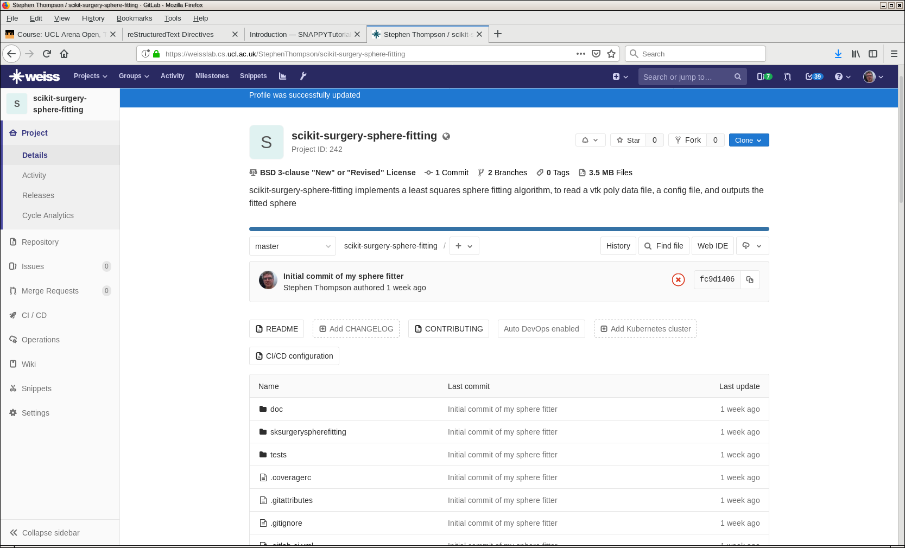

.. highlight:: shell

.. _Introduction:

===============================================
Introduction
===============================================

This is tutorial 02 for the SNAPPY software collection. SNAPPY aims to support users in
developing software applications for surgery. The aim of the tutorial is to
introduce the user to SNAPPY. After completing the tutorial the user will have;

- Used the SNAPPY Python Template to create, test, and publish an implementation of a simple 
  image processing algorithm.

After the completing the tutorial the user should be able to;

- Use gitlab to create and manage a software repository.
- Use tox and gitlab to test the software and create continuous integration tests.
- Create documentation for the software using docstrings and sphinx.
- Publish the documentation to readthedocs
- Publish the software to PyPi.

Starting Out
~~~~~~~~~~~~

Step 1: Check you have cookiecutter installed
::
  pip install cookiecutter

Step 2: Use the Python Template to create your new project. This tutorial uses an 
example of implementing an algorithm to fit a sphere to a VTK polydata surface, so 
we could call our project something descriptive.
::
  cookiecutter scikit-surgeryutils https://weisslab.cs.ucl.ac.uk/WEISS/SoftwareRepositories/PythonTemplate.git

or
::
  python -m  cookiecutter https://weisslab.cs.ucl.ac.uk/WEISS/SoftwareRepositories/PythonTemplate.git

Follow the prompts 
::
  project_name [My New Project]: scikit-surgery-sphere-fitting
  project_slug [scikit-surgery-sphere-fitting]: sksurgeryspherefitting
  project_description [scikit-surgery-sphere-fitting is a Python package]: scikit-surgery-sphere-fitting implements a least squares sphere fitting algorithm, to read a vtk poly data file, a config file, and outputs the fitted sphere
  pkg_name [sksurgeryspherefitting]:
  Select repository_server:
  1 - https://weisslab.cs.ucl.ac.uk
  2 - https://cmiclab.cs.ucl.ac.uk
  3 - https://github.com
  4 - https://gitlab.com
  Choose from 1, 2, 3, 4 (1, 2, 3, 4) [1]:
  full_name [Your Name]: Stephen Thompson
  repository_profile_name [StephenThompson]:
  Select repository_path:
  1 - StephenThompson/sksurgeryspherefitting
  2 - WEISS/SoftwareRepositories/sksurgeryspherefitting
  3 - WEISS/SoftwareRepositories/SNAPPY/sksurgeryspherefitting
  Choose from 1, 2, 3 (1, 2, 3) [1]:
  project_url [https://weisslab.cs.ucl.ac.uk/StephenThompson/sksurgeryspherefitting]:
  Select open_source_license:
  1 - BSD-3 license
  2 - Apache Software License 2.0
  3 - MIT License
  Choose from 1, 2, 3 (1, 2, 3) [1]:

Enter the source directory and initialise git repository.
::
  cd sksurgeryspherefitting/
  git init
  git add .
  git commit -m "Initial commit of my sphere fitter"

Create a new project on WeissLab (or CmicLab, GitHub or your preferred git host), making sure the URL matches what you set in step 3.

.. image:: new_project_weisslab.png
   :height: 400px
   :alt: Create new project on weisslab
   :align: center

Add the remote to git and push your first commit
::
   git remote add origin https://weisslab.cs.ucl.ac.uk/StephenThompson/scikit-surgery-sphere-fitting.git
   git push origin master

Visit the web interface to WEISSLab and checkout out your first commit

You'll notice that it say's that your commit failed. This refers to the continuous integration test failed, not that your project was lost or any thing else. By the end this tutorial you will have a green tick where now there is a red cross, for know though, don't worry.

Getting Started with Issue Tracking on WEISSlab
~~~~~~~~~~~~~~~~~~~~~~~~~~~~~~~~~~~~~~~~~~~~~~~
A critical part of quality software engineering is keeping track of changes, and maintaining a record of why changes were made. 
WEISSlab (and gitlab, github, etc) contains functions to create and track "issues". At the moment our software doesn't 
do anything, let's got to WEISSlab and create an issue.

Give the issue a name, and assign it to yourself. This should be issue number 1. 
.. image:: weisslab_new_issue_detail.png
   :height: 400px
   :alt: Check out your project on WEISS Lab
   :align: center

Getting Started with git
~~~~~~~~~~~~~~~~~~~~~~~~
Git is a widely used and high quality version control system. It is
designed for multideveloper software projects. 

Step 1: Make a new branch to start working on. Prefix it with the number 1 so we know
it's linked to issue 1.
::
   git checkout -b "1-get-working"

Why use branches, it helps keep things tidy, and enables 
multiple developer to work simultaneously (put a link in here).
You can now start modifying files.

Planning
~~~~~~~~
Thinking about what the library is supposed to do is a good way to 
start. The Python Template comes with a doc/requirements.rst file 
which is a good place to jot down initial thoughts on what the library
will or won't do. It already has some non specific requirements, 
let's add some more about what a sphere fitting algorithm should do.
Later on you could add links to unit tests to verify that the requirements
are met.

The list doesn't have to be exhaustive and will probably become obsolete, but 
it provides an opportunity to stop and think before coding. There is a 
substantial body of evidence that thinking before coding leads to better 
code.
::
  |    0003    |  Provides a function to fit a sphere to a list of      |                                     |
  |            |  3 dimensional points                                  |                                     |
  +------------+--------------------------------------------------------+-------------------------------------+
  |    0004    |  Allows for configuration via a python dictionary      |                                     |
  +------------+--------------------------------------------------------+-------------------------------------+
  |    0005    |  Provides a command line application                   |                                     |
  +------------+--------------------------------------------------------+-------------------------------------+
  |    0006    |  What else ??                                          |                                     |  
  +------------+--------------------------------------------------------+-------------------------------------+

Start Coding
~~~~~~~~~~~~
The python template is structured with a parent directory that contains various readme, licence files, together with 
three Python scripts. For the moment we don't want to modify any of these. The code we will begin with is to be found
in the subdirectory sksurgeryspherefitting
::
  cd sksurgeryspherefitting/

Within this directory are three more python scripts, __init__.py, __main__.py, and _version.py. None of these
need to be modified. The actual working code is within two subdirectories, algorithms and ui(user interface). More
complex libraries may contain more subdirectories, or less if they have no user interface. Despite the temptation 
to get the user interface working quickly, it is always good practice to start with the algorithm (`See page 44 of this`_).
::
   cd algorithms/

The SNAPPY Python template has already populated this with a couple of example algorithms, addition and multiplication.
These are nice examples, but a bit too simple for our tutorial. So lets delete them and create our own file, 
sphere_fitting.py. I chose sphere fitting as it was useful for me at the time, feel free to insert your own 
algorithm at this point.
The following code uses vim to edit the files, you can use whatever editor you like.
::
   rm addition.py mutliplication.py
   vi sphere_fitting.py

Copy and paster the following into your editor.
::
  # coding=utf-8
  """ Module for fitting a sphere to a list of 3D points """

  #scipy has a nice least squares optimisor
  from scipy.optimize import leastsq
  import numpy

  def fit_sphere_least_squares(x_values, y_values, z_values, initial_parameters):
      """
      Uses scipy's least squares optimisor to fit a sphere to a set
      of 3D Points

      :return: x: an array containing the four fitted parameters
      :return: ier: int An integer flag. If it is equal to 1, 2, 3 or 4, the
               solution was found.
      :param: (x,y,z) three arrays of equal length containing the x, y, and z
              coordinates.
      :param: an array containing four initial values (centre, and radius)
      """
      return leastsq(_calculate_residual_sphere, initial_parameters,
                     args=(x_values, y_values, z_values))

  def _calculate_residual_sphere(parameters, x_values, y_values , z_values):
      """
      Calculates the residual error for an x,y,z coordinates, fitted
      to a sphere with centre and radius defined by the parameters tuple

      :return: The residual error
      :param: A tuple of the parameters to be optimised, should contain
              [x_centre, y_centre, z_centre, radius]
      :param: arrays containing the x,y, and z coordinates.

      """
      #extract the parameters
      x_centre, y_centre, z_centre, radius = parameters

      #use numpy's sqrt function here, which works by element on arrays
      distance_from_centre = numpy.sqrt((x_values - x_centre)**2 + 
                                        (y_values - y_centre)**2 +
                                        (z_values - z_centre)**2)
      return distance_from_centre - radius

Note that there are two functions, the first FitSphere_LeastSquares is what we expect the user to call, 
once we publish this module, anyone should be able to download and fit a sphere to their point set by calling this
function with the appropriate parameters. We have added a "docstring" under the function definition to tell the user
what parameters are required and what the functions return value will be. If you want people to use your code this 
is important. 

The second function, _CalculateResidual_Sphere is used by SciPy's least square optimiser to fit the model, in this 
case a sphere, though you could rewrite it to fit any geometry you like. This function is prefixed with an underscore (_)
which tells the user that it's not meant to be called directly. It's not strictly necessary to document this function, 
but is good practice. 

That's it, you've written a sphere fitting algorithm using the Python template. Commit your changes;
::
   git rm addition.py mutliplication.py
   git add sphere_fiting.py
   git commit -m "Issue #1 implemted the sphere fitting algorithm"
   git push origin 1-get-working

Make sure you include the hashtag #1 in your commit message, so that WEISSlab can link the change to 
the issue you created earlier.

Now anyone with access to your git repository can download and use your algorithm. However they're a lot more 
likely to do that if they can see that your algorithm does what it's supposed to do. This is where the Python
template starts being really helpful. 

Start Testing with Tox
~~~~~~~~~~~~~~~~~~~~~~
The SNAPPY Python template comes preconfigured to perform functional tests on your code, to test that 
your code conforms to Python's coding style (`PEP 8`_), and produce documentation for your code. This is all
done with the helpful tox package, which is configured with the tox.ini file.

Navigate back to the project's parent directory.
::
   cd ../../

And try running tox
::
   tox

At this stage you may realise you don't have tox installed, if not try
::
   pip install tox

If tox runs, you should get lots of test failures, and a nice big chunk of output to the console,
explaining what these errors are. Let's start at the top.
::
   ImportError while importing test module '/home/thompson/src/scikit-surgery-sphere-fitting/tests/test_sksurgeryspherefitting.py'.
   Hint: make sure your test modules/packages have valid Python names.
   Traceback:
   .tox/py27/lib/python2.7/site-packages/six.py:709: in exec_
    exec("""exec _code_ in _globs_, _locs_""")
   tests/test_sksurgeryspherefitting.py:5: in <module>
      from sksurgeryspherefitting.ui.sksurgeryspherefitting_demo import run_demo
   sksurgeryspherefitting/ui/sksurgeryspherefitting_demo.py:4: in <module>
      from sksurgeryspherefitting.algorithms import addition, multiplication
   E   ImportError: cannot import name addition

The first and last two lines are the most helpful, it all started in a file in the tests directory, and ended when 
it couldn't import the name addition. That's because we deleted it and replaced it with sphere fitting. Let's 
go into the test directory,
::
   cd tests

And edit the test file 
:: 
   vi test_sksurgeryspherefitting.py

The first line imports from the user interface (ui). We'll cover this later in the tutorial, for now let's 
comment it out 
:: 
   #from sksurgeryspherefitting.ui.sksurgeryspherefitting_demo import run_demo

And comment out the first test, which is for the ui.
::
  #def test_using_pytest_sksurgeryspherefitting():
  #    x = 1
  #    y = 2
  #    verbose = False
  #    multiply = False
  #
  #    expected_answer = 3
  #    assert run_demo(x, y, multiply, verbose) == expected_answer

Then look at the second import statement, it asks to import addition and multiply from algorithms, but 
we removed them and replaced them with sphere_fitting.py, so let update the import statement
::
   from sksurgeryspherefitting.algorithms import sphere_fitting

Now scroll down and delete the two unit tests for addition and subtraction, replacing them 
with a test for FitSphere_LeastSquares

::
   def test_FitSphere_LeastSquares():

    x_centre = 1.0
    y_centre = 167.0
    z_centre = 200.0

    radius = 7.5

    #some arrays to fit data to
    xs=numpy.ndarray(shape=(1000,),dtype=float )
    ys=numpy.ndarray(shape=(1000,),dtype=float )
    zs=numpy.ndarray(shape=(1000,),dtype=float )

    #fill the arrays with points uniformly spread on 
    #a sphere centred at x,y,z with radius radius
    for i in range(1000):
        #make a random vector
        x=numpy.random.uniform(-1.0, 1.0)
        y=numpy.random.uniform(-1.0, 1.0)
        z=numpy.random.uniform(-1.0, 1.0)

        #scale it to length radius
        length=numpy.sqrt( (x)**2 + (y)**2 + (z)**2 )
        factor = radius / length

        xs[i] = x*factor + x_centre
        ys[i] = y*factor + y_centre
        zs[i] = z*factor + z_centre
       
    parameter = [0.0, 0.0, 0.0, 0.0]
    result = sphere_fitting.FitSphere_LeastSquares (xs, ys, zs, parameters)
    assert result[0][0] == x_centre

We've used some functions from numpy, so don't forget to add import numpy at the top of the file;
::
   import numpy
   
now try running tox again
::
   cd ../
   tox

you'll see that it fails, with 
::
   E   ImportError: No module named scipy.optimize

We need to tell tox that we need scipy to for this module. The file requirements.txt tells tox what 
module python needs for testing, so edit requirements and add scipy to numpy, which should already be 
there
::
   numpy
   scipy

now try running tox again, you should see a bunch of output ending something like ...
::
   ______________________________________________________ summary ______________________________________________________
   py27: commands succeeded
   py36: commands succeeded
   ERROR:   lint: commands failed

Which tells that the functional unit tests worked, but that "lint" failed. 

What is Lint

~~~~~~~~~~~~
The SNAPPY python template used lint to check that the code is well written, according to Python's PEP 8 
coding standard. At times this may seem unnecessary, as long as the code runs who cares whether it's 
tidily written? However, the aim of the SNAPPY Python template is to help create code that not only works for 
you, but will be downloaded by others, modified and spread about. That's a lot more likely to happen if your code
can be easily understood by others, and that's what lint helps you do. 

If we scroll back up through the test output we'll start finding some linting errors. The first of them
looks like this;
::
   lint runtests: commands[0] | pylint --rcfile=tests/pylintrc sksurgeryspherefitting
   ************* Module sksurgeryspherefitting.ui.sksurgeryspherefitting_command_line
   sksurgeryspherefitting/ui/sksurgeryspherefitting_command_line.py:14:0: C0301: Line too long (81/80) (line-too-long)

It's telling us that one of the lines is tool long in a file in the ui directory. We haven't started on the user 
interface yet, so let's just tell lint to ignore that directory for the moment. 
Edit the file pylintrc, which is in the tests directory. Near the top of the file is an entry called 
ignore, add "ui" to the list of things to ignore;
::
   # Add files or directories to the blacklist. They should be base names, not
   # paths.
   ignore=CVS, ui

Now try running tox again. If you've cut and pasted the code from earlier, you should get 
one linting error;
::
   sksurgeryspherefitting/algorithms/sphere_fitting.py:23:62: C0326: No space allowed before comma
   def _calculate_residual_sphere(parameters, x_values, y_values , z_values):
                                                                ^ (bad-whitespace)

As you can see, it's a minor error that effects readability.  edit sphere_fitting.py to 
fix it and rerun tox. You should now get:
::
   ______________________________________________________ summary ______________________________________________________
   py27: commands succeeded
   py36: commands succeeded
   lint: commands succeeded
   congratulations :)

If not, read the output and fix any remaining errors. If so, commit your changes and push to origin;
::
   git add requirments.txt sksurgeryspherefitting/algorithms/sphere_fiting.py tests/pylintrc
   git commit -m "Issue #1 implemted unit test and fixed style errors"
   git push origin 1-get-working

If you wait a few minutes and visit weisslab, you should be able to see your library commit passing 
with a nice green tick. Congratulations, you have mastered testing and continuous integration testing. 

Your code is working now. So lets draw a line under it. Use git to merge your branch back to master, 
and push it to the origin. Then close the issue on Weisslab.
::
   git checkout master
   git merge --no-ff 1-get-working
   git push origin master
   git branch --delete 1-get-working

Go to the WEISSlab website, and close issue 1.

Adding a User Interface
~~~~~~~~~~~~~~~~~~~~~~~
Your library is sufficient as is, you have an implementation of an algorithm, which 
an interested user could download and use within their own Python software. However, 
it's often nice to include a sample application, or some sort of user interface, so 
people can download and use your code directly. The SNAPPY Python template makes this
easy. 

Start by creating a new issue on WEISSlab, something like "Implement UI". And a new
git branch to match
::
   git checkout -b 2-implement-ui

We'll be modifying the code in the sksurgeryspherefitting/ui directory. 
Before we start, edit tests/pylintrc back to how it was, so our code gets properly tested.
::
   # Add files or directories to the blacklist. They should be base names, not
   # paths.
   ignore=CVS

Now edit sksurgeryspherefitting/ui/sksurgeryspherefitting_demo.py, so that 
it looks like:
::
  # coding=utf-8

  """Uses sphere fitting to fit to vtk model"""
  import vtk
  from sksurgeryvtk.models.vtk_surface_model import VTKSurfaceModel
  from sksurgeryspherefitting.algorithms import sphere_fitting

  def run_demo(model_file_name, output=""):
      """ Run the application """
      model = VTKSurfaceModel(model_file_name, [1., 0., 0.])
      x_values = model.get_points_as_numpy()[:, 0]
      y_values = model.get_points_as_numpy()[:, 1]
      z_values = model.get_points_as_numpy()[:, 2]

      initial_parameters = [0.0, 0.0, 0.0, 0.0]
      result = sphere_fitting.fit_sphere_least_squares(x_values,
                                                       y_values,
                                                       z_values,
                                                       initial_parameters)

      print("Result is {}".format(result))

      if output != "":

          sphere = vtk.vtkSphereSource()
          sphere.SetCenter(result[0][0], result[0][1], result[0][2])
          sphere.SetRadius(result[0][3])
          sphere.SetThetaResolution(60)
          sphere.SetPhiResolution(60)

          writer = vtk.vtkXMLPolyDataWriter()
          writer.SetFileName(output)
          writer.SetInputData(sphere.GetOutput())
          sphere.Update()
          writer.Write()

And edit sksurgeryspherefitting/ui/sksurgeryspherefitting_command_line.py:
::
  # coding=utf-8

  """Command line processing"""

  import argparse
  from sksurgeryspherefitting import __version__
  from sksurgeryspherefitting.ui.sksurgeryspherefitting_demo import run_demo

  def main(args=None):
      """Entry point for scikit-surgery-sphere-fitting application"""

      parser = argparse.ArgumentParser(
          description='scikit-surgery-sphere-fitting')

      ## ADD POSITIONAL ARGUMENTS
      parser.add_argument("model",
                          type=str,
                          help="Filename for vtk surface model")

      # ADD OPTINAL ARGUMENTS
      parser.add_argument("-o", "--output",
                          required=False,
                          type=str,
                          default="",
                          help="Write the fitted sphere to file"
                          )

      version_string = __version__
      friendly_version_string = version_string if version_string else 'unknown'
      parser.add_argument(
          "--version",
          action='version',
          version='scikit-surgery-sphere-fitting version '
          + friendly_version_string
          )

      args = parser.parse_args(args)

      run_demo(args.model, args.output)

We should also add a unit test to make sure that the demo program works, so create a file 
tests/test_sksurgeryspherefitting_demo.py and cut and paste this:
::
  # coding=utf-8

  """scikit-surgery-sphere-fitting tests"""

  from sksurgeryspherefitting.ui.sksurgeryspherefitting_demo import run_demo

  def test_fit_sphere_least_squares_demo():

      model_name = 'data/CT_Level_1.vtp'
      output_name = 'out_temp.vtp'

     run_demo (model_name, output_name)

Note that we need some testing data here. If you have a vtk surface file that you'd like to 
try fitting a sphere to you can subsitute it above. Other wise you can get one from `here`_
::
   mkdir data
   cd data
   wget https://weisslab.cs.ucl.ac.uk/StephenThompson/scikit-surgery-sphere-fitting/blob/master/data/CT_Level_1.vtp

Before you run tox again, we need to tell it about the extra dependencies we've just added, so edit
requirements.txt, which should now look like:
::
   numpy
   scipy
   vtk
   scikit-surgeryvtk

Finally we need to edit tests/pylintrc to help lint deal with python modules that use compiled libraries. 
As lint can't see inside compiled libraries it can't find do "import vtk". So we add vtk to the 
"extension-pkg-whitelist" in pylintrc (line 32):
::
   extension-pkg-whitelist=numpy, vtk

If you run tox now, you should get all unit tests passing, and 100% test coverage. And if your in the
project parent directory you should be able to run:
::
   python sksurgeryspherefitting data/CT_Level_1.vtp -o sphere.vtp

You'll see some output on the console, and if you have a vtk viewer you can load both models and see what 
you've done. 

Publishing The Documentation
~~~~~~~~~~~~~~~~~~~~~~~~~~~~
Some thing about read the docs - you'll need an account on readthedocs and can then set a webhook.

Creating a Release
~~~~~~~~~~~~~~~~~~
The SNAPPY Python template uses versioneer to define the version of your software. 

   

.. _`See page 44 of this`: https://magazines-static.raspberrypi.org/issues/full_pdfs/000/000/030/original/HelloWorld07.pdf#page=44
.. _`PEP 8`: https://www.python.org/dev/peps/pep-0008/
.. _`here`: https://weisslab.cs.ucl.ac.uk/StephenThompson/scikit-surgery-sphere-fitting/blob/master/data/CT_Level_1.vtp
