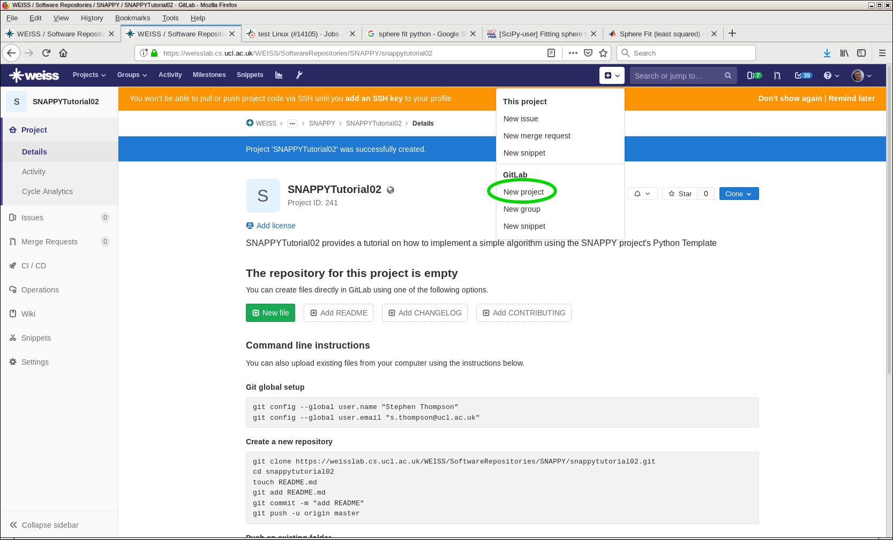

.. highlight:: shell

.. _Introduction:

===============================================
Introduction
===============================================

This is tutorial 02 for the SNAPPY software collection. SNAPPY aims to support users in
developing software applications for surgery. The aim of the tutorial is to
introduce the user to SNAPPY. After completing the tutorial the user will have;

- Used the SNAPPY Python Template to create, test, and publish an implementation of a simple 
  image processing algorithm.

After the completing the tutorial the user should be able to;

- Use gitlab to create and manage a software repository.
- Use tox and gitlab to test the software and create continuous integration tests.
- Create documentation for the software using docstrings and sphinx.
- Publish the documentation to readthedocs
- Publish the software to PyPi.

Starting Out
~~~~~~~~~~~~

Step 1: Check you have cookiecutter installed
::
  pip install cookiecutter

Step 2: Use the Python Template to create your new project. This tutorial uses an 
example of implementing an algorithm to fit a sphere to a VTK polydata surface, so 
we could call our project something descriptive.
::
  cookiecutter scikit-surgeryutils https://weisslab.cs.ucl.ac.uk/WEISS/SoftwareRepositories/PythonTemplate.git

or
::
  python -m  cookiecutter https://weisslab.cs.ucl.ac.uk/WEISS/SoftwareRepositories/PythonTemplate.git

Follow the prompts 
::
  project_name [My New Project]: scikit-surgery-sphere-fitting
  project_slug [scikit-surgery-sphere-fitting]: sksurgeryspherefitting
  project_description [scikit-surgery-sphere-fitting is a Python package]: scikit-surgery-sphere-fitting implements a least squares sphere fitting algorithm, to read a vtk poly data file, a config file, and outputs the fitted sphere
  pkg_name [sksurgeryspherefitting]:
  Select repository_server:
  1 - https://weisslab.cs.ucl.ac.uk
  2 - https://cmiclab.cs.ucl.ac.uk
  3 - https://github.com
  4 - https://gitlab.com
  Choose from 1, 2, 3, 4 (1, 2, 3, 4) [1]:
  full_name [Your Name]: Stephen Thompson
  repository_profile_name [StephenThompson]:
  Select repository_path:
  1 - StephenThompson/sksurgeryspherefitting
  2 - WEISS/SoftwareRepositories/sksurgeryspherefitting
  3 - WEISS/SoftwareRepositories/SNAPPY/sksurgeryspherefitting
  Choose from 1, 2, 3 (1, 2, 3) [1]:
  project_url [https://weisslab.cs.ucl.ac.uk/StephenThompson/sksurgeryspherefitting]:
  Select open_source_license:
  1 - BSD-3 license
  2 - Apache Software License 2.0
  3 - MIT License
  Choose from 1, 2, 3 (1, 2, 3) [1]:

Enter the source directory and initialise git repository.
::
  cd sksurgeryspherefitting/
  git init
  git add .
  git commit -m "Initial commit of my sphere fitter"

Create a new project on WeissLab (or CmicLab, GitHub or your preferred git host), making sure the URL matches what you set in step 3.

Add the remote to git and push your first commit
::
   git remote add origin https://weisslab.cs.ucl.ac.uk/StephenThompson/scikit-surgery-sphere-fitting.git
   git push origin master

Visit the web interface to WEISSLab and checkout out your first commit

.. image:: first_push_weisslab.png
   :height: 400px
   :alt: Check out your project on WEISS Lab
   :align: center

You'll notice that it say's that your commit failed. This refers to the continuous integration test failed, not that your project was lost or any thing else. By the end this tutorial you will have a green tick where now there is a red cross, for know though, don't worry.

Getting Started with git
~~~~~~~~~~~~~~~~~~~~~~~~
Git is a widely used and high quality version control system. It is
designed for multideveloper software projects. 

Step 1: Make a new branch to start working on
::
   git checkout -b "1-get-working"

Why use branches, it helps keep things tidy, and enables 
multiple developer to work simultaneously (put a link in here).
You can now start modifying files.

Planning
~~~~~~~~
Thinking about what the library is supposed to do is a good way to 
start. The Python Template comes with a doc/requirements.rst file 
which is a good place to jot down initial thoughts on what the library
will or won't do. It already has some non specific requirements, 
let's add some more about what a sphere fitting algorithm should do.
Later on you could add links to unit tests to verify that the requirements
are met.

The list doesn't have to be exhaustive and will probably become obsolete, but 
it provides an opportunity to stop and think before coding. There is a 
substantial body of evidence that thinking before coding leads to better 
code.
::
  |    0003    |  Provides a function to fit a sphere to a list of      |                                     |
  |            |  3 dimensional points                                  |                                     |
  +------------+--------------------------------------------------------+-------------------------------------+
  |    0004    |  Allows for configuration via a python dictionary      |                                     |
  +------------+--------------------------------------------------------+-------------------------------------+
  |    0005    |  Provides a command line application                   |                                     |
  +------------+--------------------------------------------------------+-------------------------------------+
  |    0006    |  What else ??                                          |                                     |  
  +------------+--------------------------------------------------------+-------------------------------------+

Start Coding
~~~~~~~~~~~~
The python template is structured with a parent directory that contains various readme, licence files, together with 
three Python scripts. For the moment we don't want to modify any of these. The code we will begin with is to be found
in the subdirectory sksurgeryspherefitting
::
  cd sksurgeryspherefitting/

Within this directory are three more python scripts, __init__.py, __main__.py, and _version.py. None of these
need to be modified. The actual working code is within two subdirectories, algorithms and ui(user interface). More
complex libraries may contain more subdirectories, or less if they have no user interface. Despite the temptation 
to get the user interface working quickly, it is always good practice to start with the algorithm (`See page 44 of this`_).
::
   cd algorithms/

The SNAPPY Python template has already populated this with a couple of example algorithms, addition and multiplication.
These are nice examples, but a bit too simple for our tutorial. So lets delete them and create our own file, 
sphere_fitting.py. I chose sphere fitting as it was useful for me at the time, feel free to insert your own 
algorithm at this point.
The following code uses vim to edit the files, you can use whatever editor you like.
::
   rm addition.py mutliplication.py
   vi sphere_fitting.py

Copy and paster the following into your editor.
::
   # coding=utf-8
   """ Module for fitting a sphere to a list of 3D points """

   #scipy has a nice least squares optimisor
   from scipy.optimize import leastsq
   import numpy

   def FitSphere_LeastSquares(x, y, z, initial_parameters):
      """
      Uses scipy's least squares optimisor to fit a sphere to a set
      of 3D Points

      :return The fitted sphere parameters, x, y, z, and radius and the residual error
      :param three lists of equal length containing the x, y, and z coordinates.
      """

      result = leastsq (CalculateResidual_Sphere, initial_parameters, args=(x,y,z))

      return result

   def _CalculateResidual_Sphere(parameters, x, y , z):
      """
      Calculates the residual error for an x,y,z coordinates, fitted
      to a sphere with centre and radius defined by the parameters tuple

      :return The residual error
      :param A tuple of the parameters to be optimised, should contain
      [x_centre, y_centre, z_centre, radius]
      :the x,y, and z coordinates.

      """

      #extract the parameters
      x_centre, y_centre, z_centre, radius = parameters

      #be sure to use numpy's sqrt function here, which works by element on arrays
      distance_from_centre = numpy.sqrt((x-x_centre)**2 + (y-y_centre)**2 + (z-z_centre)**2)
      error =  distance_from_centre - radius
      return error

Note that there are two functions, the first FitSphere_LeastSquares is what we expect the user to call, 
once we publish this module, anyone should be able to download and fit a sphere to their point set by calling this
function with the appropriate parameters. We have added a "docstring" under the function definition to tell the user
what parameters are required and what the functions return value will be. If you want people to use your code this 
is important. 

The second function, _CalculateResidual_Sphere is used by SciPy's least square optimiser to fit the model, in this 
case a sphere, though you could rewrite it to fit any geometry you like. This function is prefixed with an underscore (_)
which tells the user that it's not meant to be called directly. It's not strictly necessary to document this function, 
but is good practice. 

That's it, you've written a sphere fitting algorithm using the Python template. Commit your changes, something like
::
   git rm addition.py mutliplication.py
   git add sphere_fiting.py
   git commit -m "Issue #1 implemted the sphere fitting algorithm"
   git push origin 1-get-working

Now anyone with access to your git repository can download and use your algorithm. However they're a lot more 
likely to do that if they can see that your algorithm does what it's supposed to do. This is where the Python
template starts being really helpful. 

Start Testing with Tox
~~~~~~~~~~~~~~~~~~~~~~
The SNAPPY Python template comes preconfigured to perform functional tests on your code, to test that 
your code conforms to Python's coding style (`PEP 8`_), and produce documentation for your code. This is all
done with the helpful tox package, which is configured with the tox.ini file.

Navigate back to the project's parent directory.
::
   cd ../../

And try running tox
::
   tox

At this stage you may realise you don't have tox installed, if not try
::
   pip install tox

If tox runs, you should get lots of test failures, and a nice big chunk of output to the console,
explaining what these errors are. Let's start at the top.
::
   ImportError while importing test module '/home/thompson/src/scikit-surgery-sphere-fitting/tests/test_sksurgeryspherefitting.py'.
   Hint: make sure your test modules/packages have valid Python names.
   Traceback:
   .tox/py27/lib/python2.7/site-packages/six.py:709: in exec_
    exec("""exec _code_ in _globs_, _locs_""")
   tests/test_sksurgeryspherefitting.py:5: in <module>
      from sksurgeryspherefitting.ui.sksurgeryspherefitting_demo import run_demo
   sksurgeryspherefitting/ui/sksurgeryspherefitting_demo.py:4: in <module>
      from sksurgeryspherefitting.algorithms import addition, multiplication
   E   ImportError: cannot import name addition

The first and last two lines are the most helpful, it all started in a file in the tests directory, and ended when 
it couldn't import the name addition. That's because we deleted it and replaced it with sphere fitting. Let's 
go into the test directory,
::
   cd tests

And edit the test file 
:: 
   vi test_sksurgeryspherefitting.py

The first line imports from the user interface (ui). We'll cover this later in the tutorial, for now let's 
comment it out 
:: 
   #from sksurgeryspherefitting.ui.sksurgeryspherefitting_demo import run_demo

And comment out the first test, which is for the ui.
::
  #def test_using_pytest_sksurgeryspherefitting():
  #    x = 1
  #    y = 2
  #    verbose = False
  #    multiply = False
  #
  #    expected_answer = 3
  #    assert run_demo(x, y, multiply, verbose) == expected_answer

.. _`See page 44 of this`: https://magazines-static.raspberrypi.org/issues/full_pdfs/000/000/030/original/HelloWorld07.pdf#page=44
.. _`PEP 8`: https://www.python.org/dev/peps/pep-0008/
