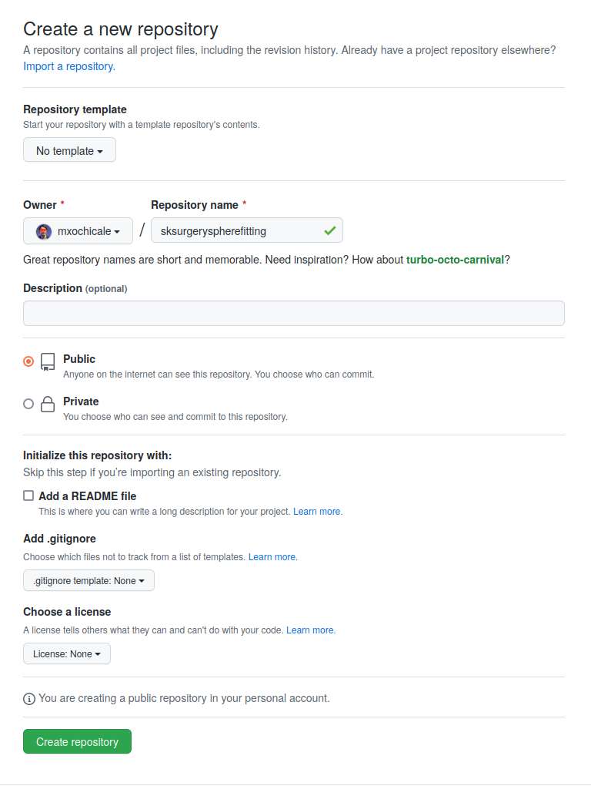
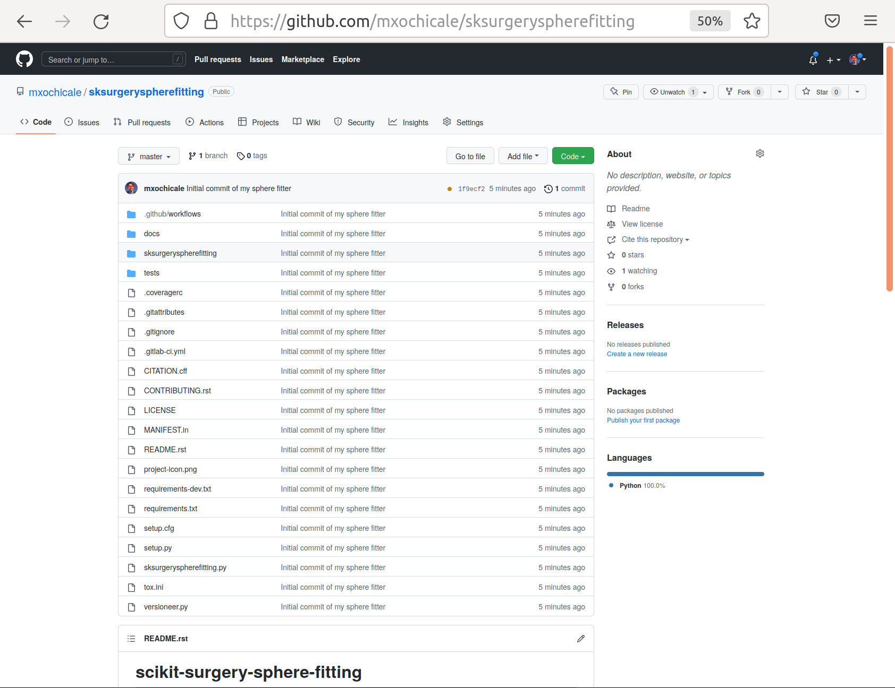

.. highlight:: shell

.. _Getting Started:

===============================================
Getting Started
===============================================

Packages and other requirements
~~~~~~~~~~~~
scikit-surgery-sphere-fitting require pandoc: universal document converter `pandoc_installation`_.

Virtual environments
~~~~~~~~~~~~
Virtualenv, venv, conda or pyenv can be used to create virtual environments to manage python packages.
You can use conda env by installing conda for your OS (`conda_installation`_) and use the following yml file with all dependencies.
::
   ## Create scikit-surgerytutorial02VE.yml in your favorite location with the following content:
   ##
   ##  scikit-surgerytutorial02VE.yml
   ##
   ## Some useful commands to manage your conda env:
   ## LIST CONDA ENVS: conda list -n *VE # show list of installed packages
   ## UPDATE CONDA: conda update -n base -c defaults conda
   ## INSTALL CONDA EV: conda env create -f *VE.yml
   ## UPDATE CONDA ENV: conda env update --file *VE.yml --prune
   ## ACTIVATE CONDA ENV: conda activate *VE
   ## REMOVE CONDA ENV: conda remove -n *VE --all

   name: scikit-surgerytutorial02VE
   channels:
     - defaults
     - conda-forge #vtk; tox;
     - anaconda #coverage; scipy;
   dependencies:
     - python=3.7
     - cookiecutter>=1.7.3
     - numpy>=1.21.5
     - scipy>=1.7.3
     - tox>=3.26.0
     - pytest>=7.1.2
     - pylint>=2.14.5
     - vtk>=9.0.3
     - pip>=22.2.2
     - pip:
        - scikit-surgeryvtk>=1.0.6
        - scikit-surgeryimage>=0.10.1
        - scikit-surgerycore>=0.6.10

Creating PythonTemplate
~~~~~~~~~~~~
Step 1: The SciKit-Surgery Python Templates uses `cookiecutter`_ to generate a project from a 
templates. Start by checking you have cookiecutter installed
::

  pip install cookiecutter

Step 2: Use the Python Template to create your new project. 
This tutorial uses a `sphere fitting algorithm`_ as an example case, as it 
strikes a nice balance between simplicity and usefulness. Fitting models to data
is a key part of medical image computing, so hopefully the user can see how their own 
algorithms could be inserted into the software template.
::

  conda activate scikit-surgerytutorial02VE
  cookiecutter https://github.com/SciKit-Surgery/PythonTemplate.git

If that doesn't work try,
::

  python -m  cookiecutter https://github.com/SciKit-Surgery/PythonTemplate.git 

Follow the prompts, we should call our project something descriptive, so if you're doing sphere fitting:
::

  project_name [My New Project]: scikit-surgery-sphere-fitting
  project_slug [scikit-surgery-sphere-fitting]: sksurgeryspherefitting
  project_description [scikit-surgery-sphere-fitting is a Python package]:
                                  scikit-surgery-sphere-fitting implements
                                  a least squares sphere fitting algorithm,
                                  to read a vtk poly data file, a config file,
                                  and outputs the fitted sphere.
  pkg_name [sksurgeryspherefitting]:
  Select repository_server:
  1 - https://github.com
  2 - https://weisslab.cs.ucl.ac.uk
  3 - https://cmiclab.cs.ucl.ac.uk
  4 - https://gitlab.com
  Choose from 1, 2, 3, 4 [1]: 1
  full_name [Your Name]: Miguel Xochicale
  repository_profile_name [e.g. Your GitHub Username]: mxochicale
  Select repository_path:
  1 - mxochicale/sksurgeryspherefitting
  2 - SciKit-Surgery/sksurgeryspherefitting
  3 - UCL/sksurgeryspherefitting
  4 - niftk/sksurgeryspherefitting
  5 - /sksurgeryspherefitting
  Choose from 1, 2, 3, 4, 5 [1]: 1
  project_url [https://github.com/mxochicale/sksurgeryspherefitting]:
  Select open_source_license:
  1 - BSD-3 license
  2 - Apache Software License 2.0
  3 - MIT License
  Choose from 1, 2, 3 [1]: 1
  copyright_holder [University College London]:

Initialise git repository
~~~~~~~~~~~~
Enter the source directory and initialise git repository.
::

  cd sksurgeryspherefitting/
  git init
  git add .
  git commit -m "Initial commit of my sphere fitter"

Create a new project on GitHub (or GitLab, WeissLab or your preferred git host), making sure the URL matches
what you set in step 3 (e.g., `project_url [https://github.com/mxochicale/sksurgeryspherefitting]`.

Add the remote to git and push your first commit
::

   git remote add origin https://github.com/mxochicale/sksurgeryspherefitting.git
   git push origin master

Visit the web interface to GitHub (or your preferred git host) and checkout out your first commit

You may notice that it says that your commit failed.
This refers to the continuous integration test having failed, not that your project was lost.
By the end this tutorial you will have a green tick where now there is a red cross, for know though, don't worry.

.. _`cookiecutter`: https://cookiecutter.readthedocs.io/en/latest/
.. _`sphere fitting algorithm`: https://scikit-surgery-sphere-fitting.readthedocs.io/en/latest/
.. _`pandoc_installation` : https://pandoc.org/installing.html
.. _`conda_installation` : https://conda.io/projects/conda/en/latest/user-guide/install/index.html
