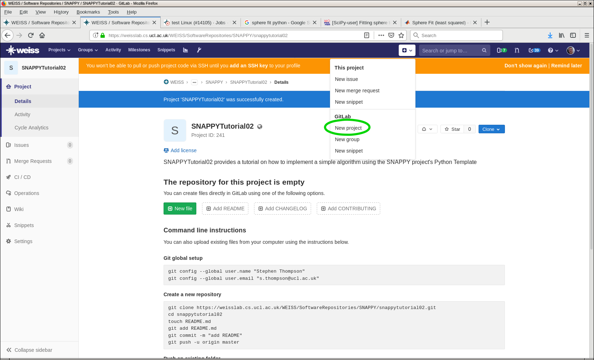
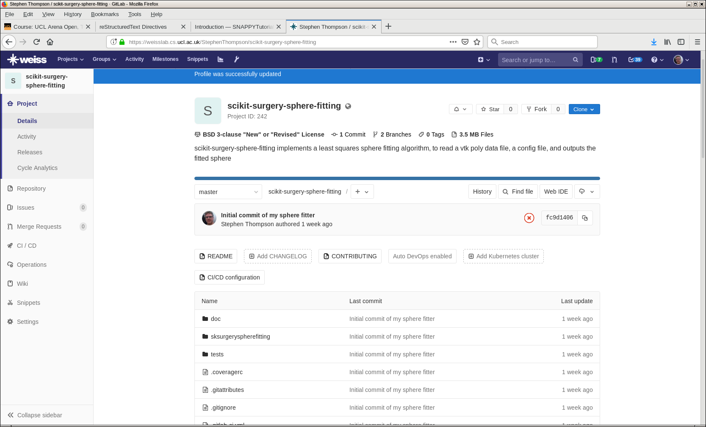

.. highlight:: shell

.. _Getting Started:

===============================================
Getting Started
===============================================

Step 1: The SNAPPY Python Templates uses `cookiecutter`_ to generate a project from a 
templates. Start by checking you have cookiecutter installed
::
  pip install cookiecutter

Step 2: Use the Python Template to create your new project. 
This tutorial uses a `sphere fitting algorithm`_ as an example case, as it 
strikes a nice balance between simplicity and usefulness. Fitting models to data
is a key part of medical image computing, so hopefully the user can see some application
for a slightly modified algorithm in their own work.
::
  cookiecutter scikit-surgeryutils https://weisslab.cs.ucl.ac.uk/WEISS/SoftwareRepositories/PythonTemplate.git

If that doesn't work try,
::
  python -m  cookiecutter https://weisslab.cs.ucl.ac.uk/WEISS/SoftwareRepositories/PythonTemplate.git

Follow the prompts, we should call our project something descriptive, so if your doing sphere fitting:
::
  project_name [My New Project]: scikit-surgery-sphere-fitting
  project_slug [scikit-surgery-sphere-fitting]: sksurgeryspherefitting
  project_description [scikit-surgery-sphere-fitting is a Python package]: scikit-surgery-sphere-fitting implements a least squares sphere fitting algorithm, to read a vtk poly data file, a config file, and outputs the fitted sphere
  pkg_name [sksurgeryspherefitting]:
  Select repository_server:
  1 - https://weisslab.cs.ucl.ac.uk
  2 - https://cmiclab.cs.ucl.ac.uk
  3 - https://github.com
  4 - https://gitlab.com
  Choose from 1, 2, 3, 4 (1, 2, 3, 4) [1]:
  full_name [Your Name]: Stephen Thompson
  repository_profile_name [StephenThompson]:
  Select repository_path:
  1 - StephenThompson/sksurgeryspherefitting
  2 - WEISS/SoftwareRepositories/sksurgeryspherefitting
  3 - WEISS/SoftwareRepositories/SNAPPY/sksurgeryspherefitting
  Choose from 1, 2, 3 (1, 2, 3) [1]:
  project_url [https://weisslab.cs.ucl.ac.uk/StephenThompson/sksurgeryspherefitting]:
  Select open_source_license:
  1 - BSD-3 license
  2 - Apache Software License 2.0
  3 - MIT License
  Choose from 1, 2, 3 (1, 2, 3) [1]:

Enter the source directory and initialise git repository.
::
  cd sksurgeryspherefitting/
  git init
  git add .
  git commit -m "Initial commit of my sphere fitter"

Create a new project on WeissLab (or CmicLab, GitHub or your preferred git host), making sure the URL matches what you set in step 3.

Add the remote to git and push your first commit
::
   git remote add origin https://weisslab.cs.ucl.ac.uk/StephenThompson/scikit-surgery-sphere-fitting.git
   git push origin master

Visit the web interface to WEISSLab and checkout out your first commit

You may notice that it says that your commit failed. This refers to the continuous integration test having failed, not that your project was lost. By the end this tutorial you will have a green tick where now there is a red cross, for know though, don't worry.

.. _`cookiecutter`: https://cookiecutter.readthedocs.io/en/latest/
.. _`sphere fitting algorithm`: https://scikit-surgery-sphere-fitting.readthedocs.io/en/latest/
