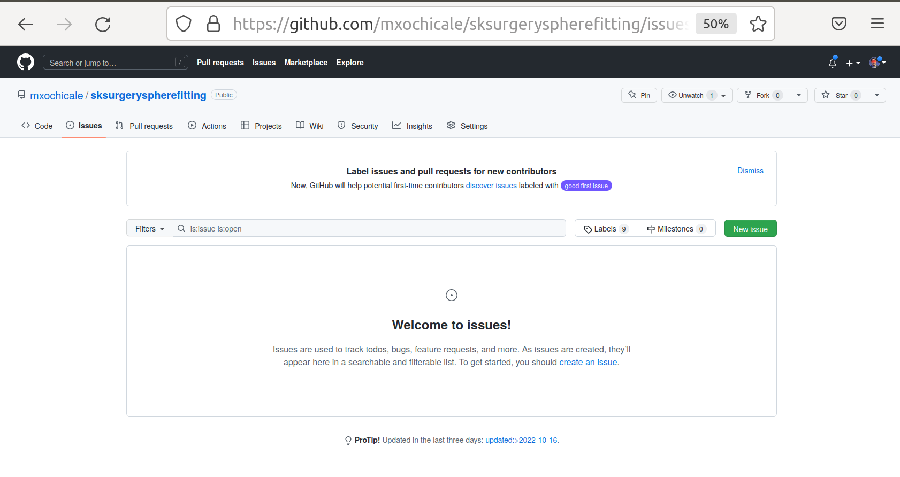
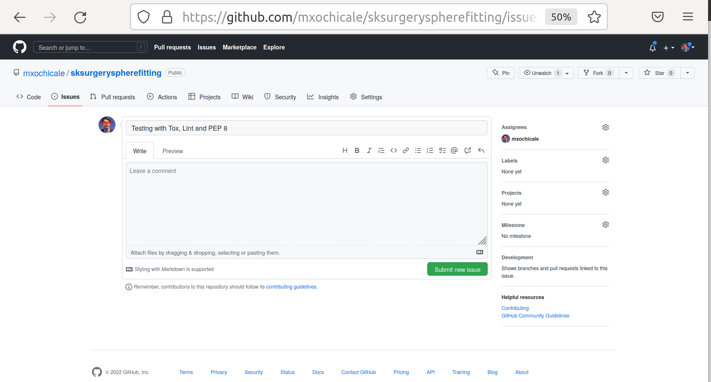

.. highlight:: shell

.. _IssueTracking:

===============================================
Getting Started with Issue Tracking on GitHub
===============================================

A critical part of quality software engineering is keeping track of changes, and maintaining a record of why changes were made. 
GitHub (or your preferred git host) contains functions to create and track issues.
Issues can be feature requests, bug fixes etc. At the moment our software doesn't 
do anything, so let's go to GitHub and create an issue.

Give the issue a name, and assign it to yourself. This should be issue number 1. 

