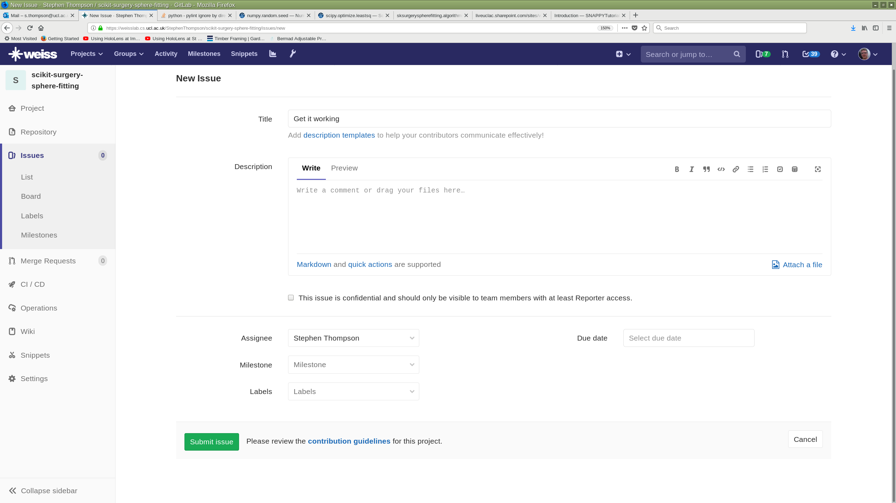

.. highlight:: shell

.. _Issue_Tracking

===============================================
Getting Started with Issue Tracking on WEISSlab
===============================================

A critical part of quality software engineering is keeping track of changes, and maintaining a record of why changes were made. 
WEISSlab (and gitlab, github, etc) contains functions to create and track "issues". At the moment our software doesn't 
do anything, let's got to WEISSlab and create an issue.

.. image:: weisslab_new_issue.png
   :height: 400px
   :alt: Check out your project on WEISS Lab
   :align: center

Give the issue a name, and assign it to yourself. This should be issue number 1. 

