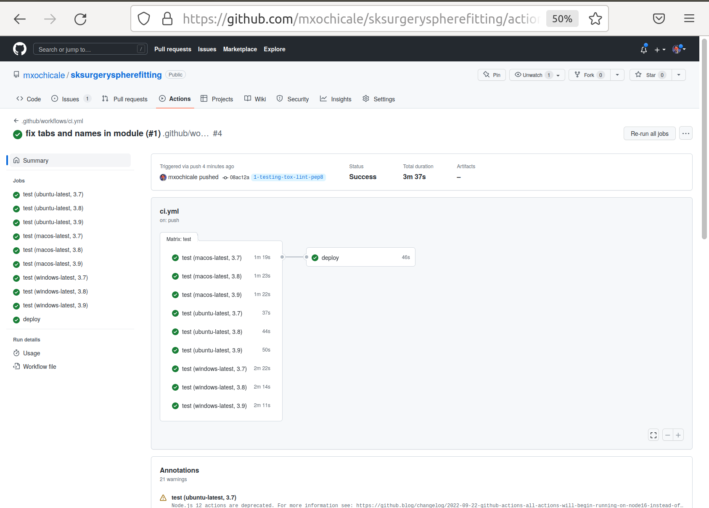

.. highlight:: shell

.. _Linting:

===============================================
What is Lint and PEP 8
===============================================
The SciKit-Surgery python template uses `pylint`_ to check that the code is well written, according to Python's `PEP 8`_ 
coding standard. At times this may seem unnecessary, as long as the code runs who cares whether it's 
tidily written? However, the aim of the SciKit-Surgery Python template is to help create code that not only works for 
you, but will be downloaded by others, modified and spread about. That's a lot more likely to happen if your code
can be easily understood by others, and that's what lint helps you do. 

If we scroll back up through the test output we'll start finding some linting errors. Depending on 
how well you've cut and pasted you may have other errors, but let's look at the first one I get, which
looks like this;
::

   lint runtests: commands[0] | pylint --rcfile=tests/pylintrc sksurgeryspherefitting
   ************* Module sksurgeryspherefitting.ui.sksurgeryspherefitting_command_line
   sksurgeryspherefitting/ui/sksurgeryspherefitting_command_line.py:14:0: C0301: Line too long (81/80) (line-too-long)

It's telling us that one of the lines is too long in a file in the ui directory. We haven't started on the user 
interface yet, and the file in question was auto generated by the Python Template. 
Let's just tell pylint to ignore the ui directory for the moment. 
Edit the file pylintrc, which is in the tests directory. Near the top of the file is an entry called 
ignore, add "ui" to the list of things to ignore;
::

   # Add files or directories to the blacklist. They should be base names, not
   # paths.
   ignore=CVS, ui

Now try running tox again (e.g, `tox -r`). If you've cut and pasted the code from earlier, you should then get
one linting error;
::

   sksurgeryspherefitting/algorithms/sphere_fitting.py:23:62: C0326: No space allowed before comma
   def _calculate_residual_sphere(parameters, x_values, y_values , z_values):
                                                                ^ (bad-whitespace)

   Run pylint --rcfile=tests/pylintrc sksurgeryspherefitting tests
   ************* Module tests.test_sksurgeryspherefitting
   tests/test_sksurgeryspherefitting.py:22:0: W0311: Bad indentation. Found 2 spaces, expected 4 (bad-indentation)
   tests/test_sksurgeryspherefitting.py:23:0: W0311: Bad indentation. Found 2 spaces, expected 4 (bad-indentation)
   ...
   tests/test_sksurgeryspherefitting.py:55:0: W0311: Bad indentation. Found 2 spaces, expected 4 (bad-indentation)
   tests/test_sksurgeryspherefitting.py:21:0: C0116: Missing function or method docstring (missing-function-docstring)

As you can see, those are minor error that effects readability but you can edit sphere_fitting.py and test_sksurgeryspherefitting.py
to fix it and rerun tox.
Pycharm has a `Reformat Code`_ option that can help to fix such readability issues.
You should now get:
::

   ______________________________________________________ summary ______________________________________________________
   py36: commands succeeded
   lint: commands succeeded
   congratulations :)

If not, read the output and fix any remaining errors. Once you have all tests passing, commit your changes and push to origin;
::

   git add tests/test_sksurgeryspherefitting.py
   git add setup.py requirements.txt sksurgeryspherefitting/algorithms/sphere_fitting.py tests/pylintrc tests/test_sksurgeryspherefitting.py
   git commit -m "implemented unit test and fixed style errors (#1)"
   git push origin 1-testing-tox-lint-pep8

If you wait a few minutes and visit GitHub, you should be able to see your library commit passing
with a nice green tick. Congratulations, you have mastered testing and continuous integration testing. 

Your code is working now. So lets draw a line under it. Use git to merge your branch back to main,
and push it to the origin. Then close the issue on GitHub.
::

   git checkout main
   git merge --no-ff 1-testing-tox-lint-pep8
   git push origin main
   git branch --delete 1-testing-tox-lint-pep8

Go to the GitHub website, and close issue 1.

.. _`PEP 8`: https://www.python.org/dev/peps/pep-0008/
.. _`pylint`: https://www.pylint.org/
.. _`Reformat Code`: https://www.jetbrains.com/help/pycharm/reformat-and-rearrange-code.html
