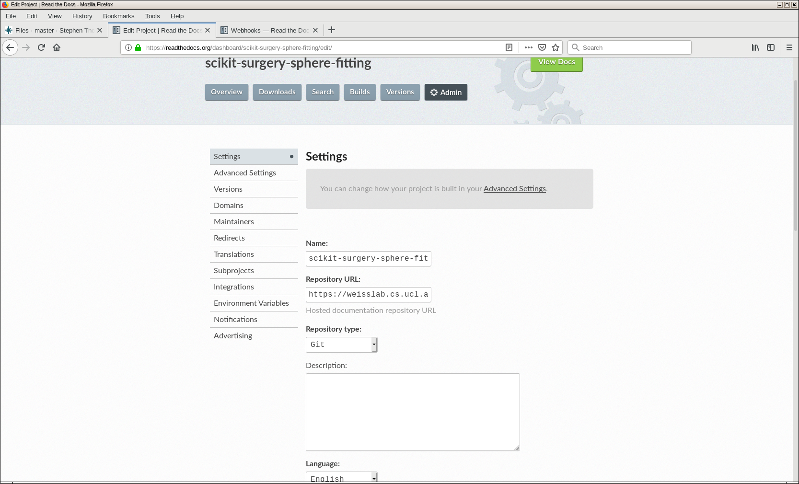

.. highlight:: shell

.. _Documentation:

===============================================
Publishing The Documentation
===============================================
The Python template automatically generates documentation for your project. 
Provided that you document your source code with Python docstrings, the Python
template should be set up to use `sphinx`_ to generate nicely formatted 
html documentation, using the command
::
   tox -e docs

We use `readthedocs`_ to host our documentation, as it is then easily accessible to 
all and sundry. At this stage you'll need to create an account on readthedocs. This is
easy and free.

Once you have an account, you can import your project.

Fill in the project name and the project url (weisslab/etc)

Now you need to connect your readthedocs project to your WEISSLab project, 
we use a `webhook`_ to do this. Go to the admin area of your readthedocs
project, and add a github incoming webhook integration.

This will guide you through the process and give a url you can add to your WEISSLab 
project. Return to WEISSLab and go to project settings.

And enter the readthedocs url into the URL field.

Test it out. You're documentation on readthedocs should now be
automatically updated each time you push a commit to WEISSLab

.. _`sphinx`: http://www.sphinx-doc.org/en/master/
.. _`readthedocs`: https://readthedocs.org/
.. _`webhook`: https://en.wikipedia.org/wiki/Webhook
