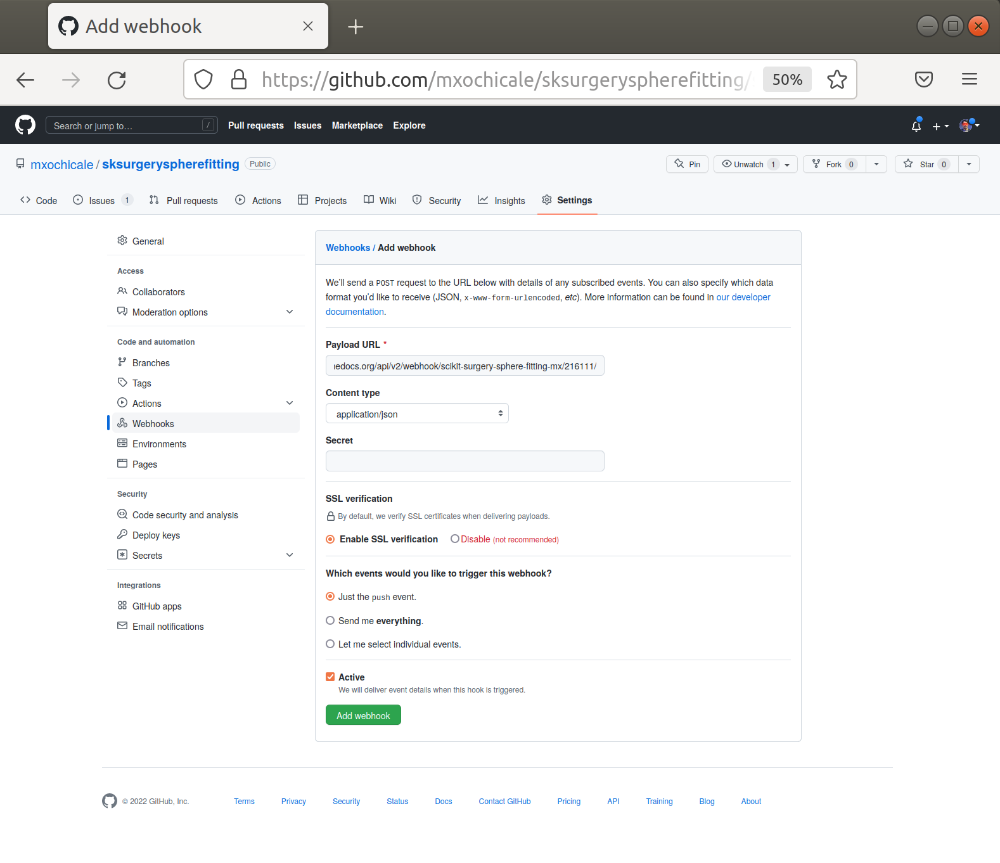

.. highlight:: shell

.. _Documentation:

===============================================
Publishing The Documentation
===============================================
The Python template automatically generates documentation for your project. 
Provided that you document your source code with Python docstrings, the Python
template should be set up to use `sphinx`_ to generate nicely formatted 
html documentation, using the command
::

   tox -e docs

We use `readthedocs`_ to host our documentation, as it is then easily accessible to all and sundry.
You might need to install pandoc which `pandoc_installation`_
At this stage you'll need to create an account on readthedocs. This is easy and free.

Once you have an account, you can import your project manually `readthedocs_import`_, filling in the project name
and the project url (github/etc)

Now you need to connect your readthedocs project to your GitHub project,
we use a `webhook`_ to do this. Go to the admin area of your readthedocs
project, and add a `github_incoming_webhook`_ integration.

This will guide you through the process and give a url you can add to your GitHub project.
Return to GitHub and go to project settings.

And enter the readthedocs url into the URL field.

Test it out.
Your documentation on readthedocs should now be automatically updated each time you push a commit to GitHub.

.. _`sphinx`: http://www.sphinx-doc.org/en/master/
.. _`readthedocs`: https://readthedocs.org/
.. _`webhook`: https://en.wikipedia.org/wiki/Webhook
.. _`github_incoming_webhook`: https://docs.github.com/en/developers/webhooks-and-events/webhooks/about-webhooks
.. _`pandoc_installation`: https://pandoc.org/installing.html
.. _`readthedocs_import`: https://readthedocs.org/dashboard/import/manual